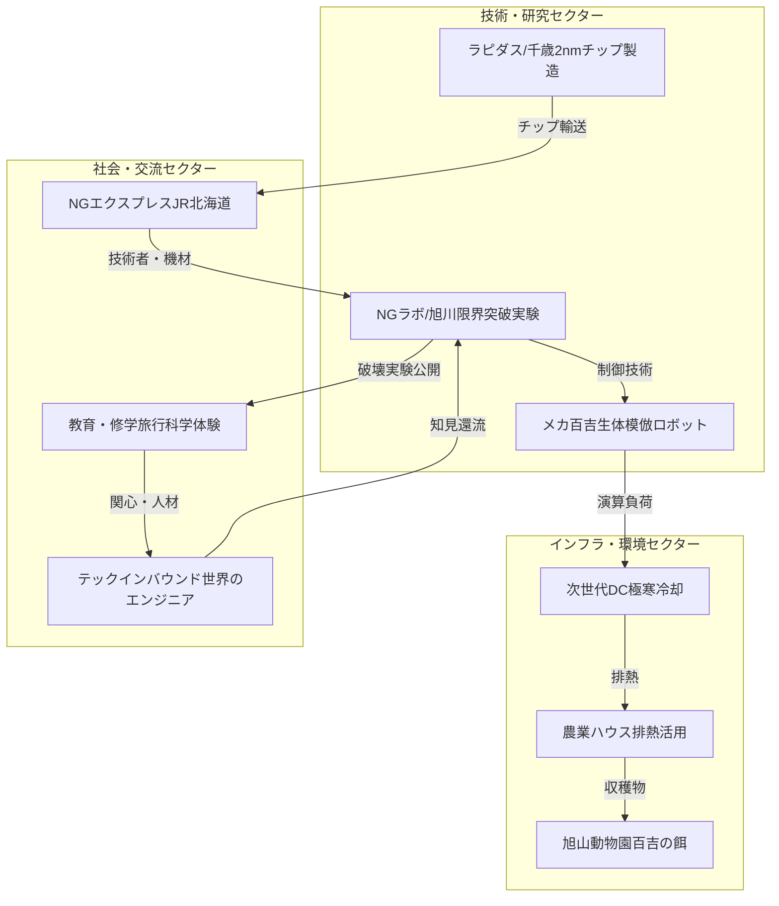

# asahikawa-model

# 旭川次世代共生型技術実証プロジェクト

**～半導体で百吉（モモチ）の餌を作る会～**

## このリポジトリについて

宇宙データセンターという「地球からの逃避」に対する、地上での対案です。

ビッグテックは冷却水と電力の限界を理由に宇宙へ向かおうとしています。しかし、寒冷地のポテンシャルを本当に使い切ったのでしょうか？

このプロジェクトは、北海道・旭川の極寒環境を「世界一過酷なテスト場」として活用し、半導体開発の加速と地域経済の循環を同時に実現する構想です。

## 基本構造

## なぜ「百吉」なのか

技術論だけでは人は動きません。

カバのロボット「メカ百吉」をフラッグシップに据えることで、最先端技術と市民感情を接続します。子どもたちが「百吉のために半導体を作っている」と理解できる——それが、この構想の設計思想です。

## ドキュメント

この構想は3つの文書で構成されています。それぞれ単独でも使えます。

| 文書 | 視点 |
|------|------|
| [グランドデザイン](./docs/grand-design.md) | 全体像と思想 |
| [提言書](./docs/proposal.md) | 地域経済・予算配分 |
| [JR北海道向け企画](./docs/jr-plan.md) | 物流・事業性 |

**読む順序の推奨：** グランドデザイン → 提言書 → JR企画

## 状態

**構想段階 / 未提案**

この文書は、いつか必要とする人のために置いてあります。引用・フォーク・発展、自由にどうぞ。

## 背景にある考え方

技術は人間の尊厳に奉仕すべきである。

宇宙に逃げる前に、地域と共生する道を探るべきである。
